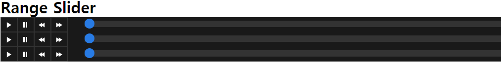

# GimhsSlider

Input Range Slider module 커스텀하여 사용하기.



## 시작하기

1. [./range.css](./range.css) 추가하기.
2. [./range.js](./range.js) 추가하기.
3. html 작성하기.

## 태그 생성

input 태그에 id를 넣어 생성한다.

```
<input id="myRange"/>
```

## 객체 생성

Gaia3dSlider 객체 생성시 매개변수로 input태그의 id를 넣는다.

```
var gs = new Gaia3dSlider('myRange');
```

## 속성 설정

객체에 속성을 추가하여 원하는 range slider를 만들어 보자.

1. Min/Max설정

    슬라이더의 시작값과 마지막값을 지정해 범위를 설정할 수 있습니다.
```
gs.setMax(20);
gs.setMin(5);
```


2. Step설정

    range thumb가 이동하는 단위를 설정 할 수 있습니다.
```
gs.setStep(2);
```


3. Duration설정

    슬라이더의 재생 속도를 설정할 수 있습니다.(ms단위임)
```
gs.setDuration(1000);
```

## 속성 추출

객체에 속성을 추출하여 사용할 수 있다.

1. Min/Max추출

    슬라이더의 시작값과 마지막값을 추출할 수 있습니다.
```
gs.getMax();
gs.getMin();
```


2. Step추출

    range thumb가 이동하는 단위를 추출할 수 있습니다.
```
gs.getStep();
```


3. Duration추출

    슬라이더의 재생 속도를 추출할 수 있습니다.(ms단위임)
```
gs.getDuration();
```

4. Value추출

    슬라이더의 현재 값을 추출할 수 있습니다.
```
gs.getValue();
```
